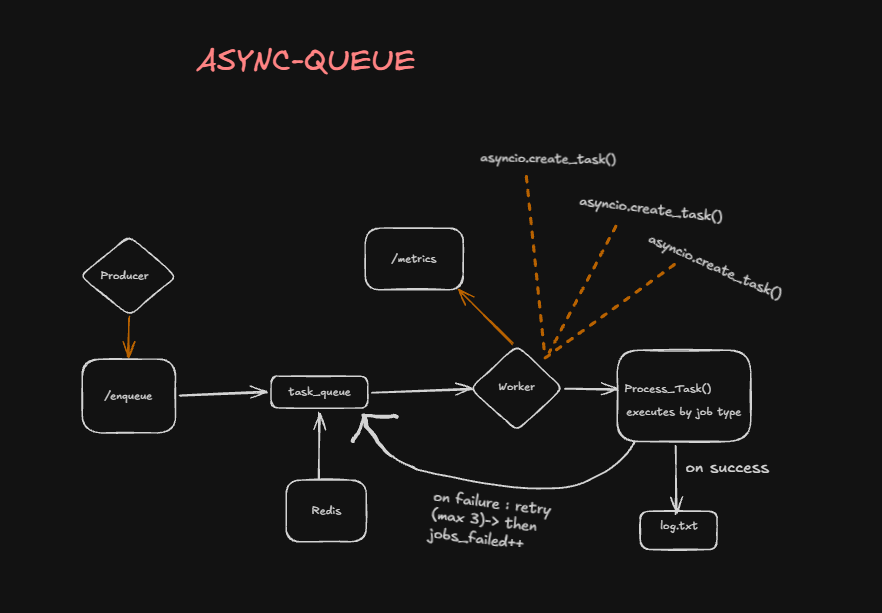

# Async-Queue

A distributed background job processing system built with **Python, FastAPI, Redis, and asyncio**.

This is not tied to any specific task. It's a general-purpose backend service — any application can hand off slow or asynchronous work to it, and it handles queuing, concurrent execution, retries, and monitoring.

## Why this exists

Any backend eventually has work that shouldn't block the main request — calling a slow third-party API, processing an upload, running a report, or anything else that takes time. Handling this inline makes the client wait and makes the server harder to scale.

Async-Queue solves this generically by separating **job submission** from **job execution**:

- **Producer** accepts any job (defined by a `type` and a `payload`) and immediately responds.
- **Redis** stores pending jobs in a queue.
- **Worker** processes jobs asynchronously in the background, independent of the producer.

Because job handling is dispatched by `type`, this system isn't built around any one use case — new job types can be plugged in without changing the core architecture.

## Architecture



The system consists of:

1. **Producer** — FastAPI service that exposes `POST /enqueue`
2. **Redis** — stores pending jobs in `task_queue`
3. **Worker** — continuously consumes jobs from Redis and processes them concurrently using `asyncio`

### Why asyncio

Most background jobs spend the bulk of their time _waiting_ on I/O — a network call, a database write, an external API — rather than doing heavy computation. `asyncio.create_task()` lets multiple jobs run concurrently on a single event loop, switching between them whenever one is waiting, without the overhead of managing OS threads. Since jobs here are typically I/O-bound rather than CPU-bound, this gives most of the benefit of concurrency without the complexity of `threading` or the overkill of `multiprocessing`.

## Job Format

The system accepts any job in this shape — `type` and `payload` are generic, so the same producer and worker handle whatever job types are registered:

```json
{
  "type": "send_email",
  "retries": 3,
  "payload": {
    "to": "user@gmail.com",
    "subject": "Testing Async-Queue"
  }
}
```

- `type` — identifies which handler should process this job
- `retries` — maximum retry attempts
- `payload` — job-specific data, structure depends on `type`

## Worker

The worker continuously pulls jobs from Redis using `BLPOP` and processes them using `asyncio.create_task()`, dispatching each job to a handler based on its `type`.

**No job types are built into the core system.** The examples below exist only to demonstrate the pattern:

```
send_email
resize_image
generate_pdf
```

Adding a new job type means writing one handler function and registering it — the queue, retry logic, and metrics all work unchanged for any job type.

## Retry Handling

If a job fails, the worker retries it until the configured retry limit is reached. This is generic to all job types, not specific to any one handler.

```
Job fails
   ↓
Retry
   ↓
Retry limit reached?
   ├── No → Queue again
   └── Yes → Mark as failed
```

Job outcomes are logged for tracking and debugging.

## Tech Stack

- Python 3.11+
- FastAPI — API / Producer
- Redis — job queue
- redis.asyncio — asynchronous Redis client
- asyncio — concurrent job execution
- Pydantic — request validation

## Running Locally

**1. Start Redis**

```bash
docker run -d -p 6379:6379 redis
```

**2. Install dependencies**

```bash
pip install -r requirements.txt
```

**3. Start the Producer**

```bash
uvicorn producer:app --reload
```

**4. Start the Worker**

In a separate terminal:

```bash
python worker.py
```

**5. Enqueue a Job**

The example below uses `send_email` purely to demonstrate the request format — any registered job type works the same way:

```bash
curl -X POST http://localhost:8000/enqueue \
  -H "Content-Type: application/json" \
  -d "{\"type\":\"send_email\",\"retries\":3,\"payload\":{\"to\":\"user@gmail.com\",\"subject\":\"Hello\"}}"
```

**6. Check Metrics**

```bash
curl http://localhost:8000/metrics
```

## Roadmap

- [x] Basic Redis-backed job queue
- [x] Asynchronous job execution
- [x] Basic retry handling
- [ ] Exponential backoff
- [ ] Jitter
- [ ] Dead Letter Queue
- [ ] Stale job recovery
