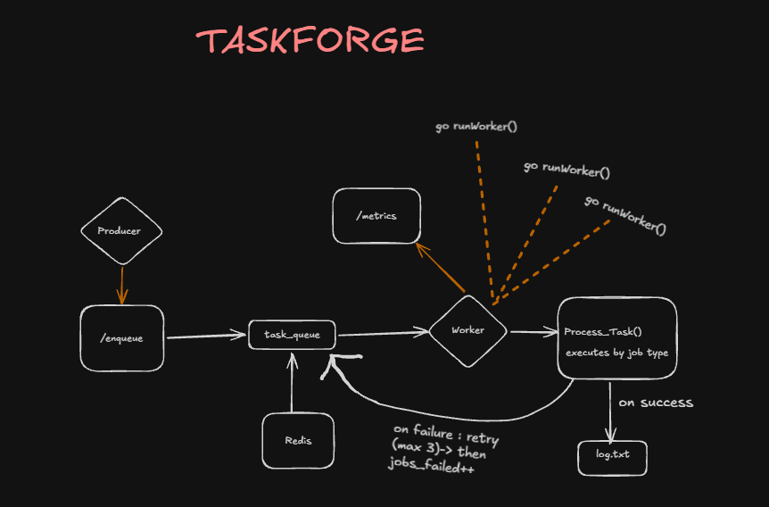
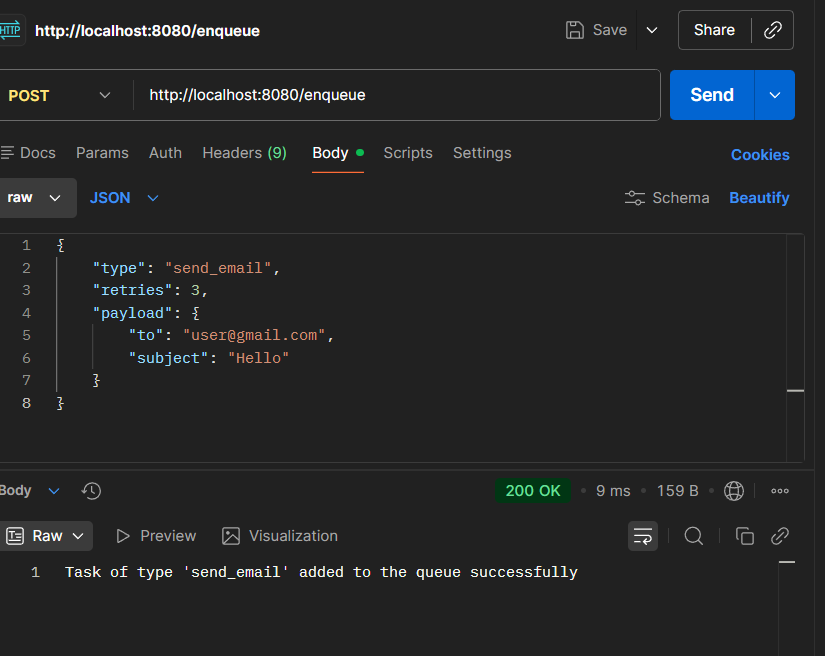
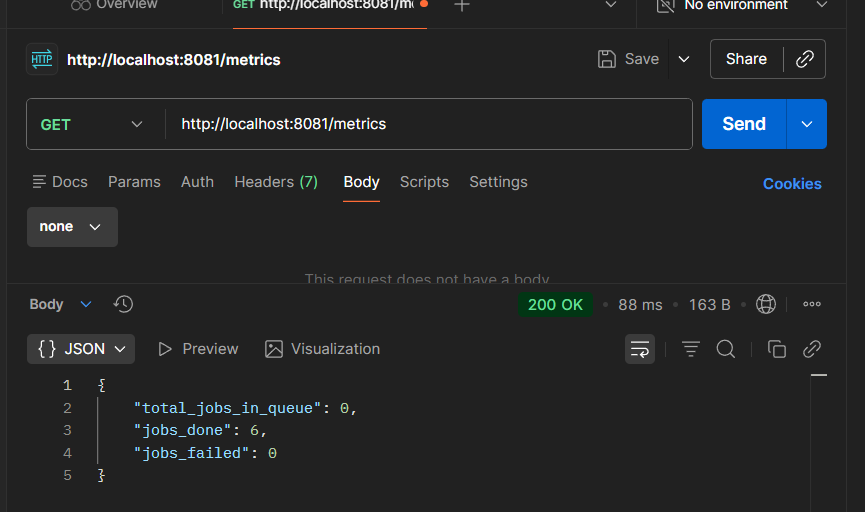
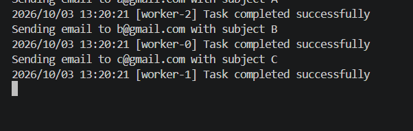

# TaskForge

A background job processing system built with **Go and Redis**.

TaskForge takes jobs from an API, puts them into a Redis queue, and processes them in the background using workers.



## How it works

```text
User
 ↓
Go API
 ↓
Redis Queue
 ↓
Worker
 ↓
Process Job
```

The API adds jobs to Redis, while the worker picks them up and processes them separately — so the API can respond immediately instead of waiting for the job to finish.

## V1 Features

- Go HTTP API for adding jobs
- Redis-based job queue
- Background worker
- Concurrent job processing using goroutines
- Basic retry handling
- Basic metrics and logging

## Example Job

```json
{
  "type": "send_email",
  "retries": 3,
  "payload": {
    "to": "user@gmail.com",
    "subject": "Testing TaskForge"
  }
}
```



Job types are not limited to email. Other examples could be image processing, PDF generation, file processing, etc. — the system itself doesn't care what the job actually does.

## Metrics

```json
{
  "total_jobs_in_queue": 0,
  "jobs_done": 6,
  "jobs_failed": 0
}
```



## Proving the concurrency

Each `send_email` job pauses for 2 seconds to simulate something slow. Sending 3 jobs at once and having all 3 finish within the same second — not 6 seconds apart — shows they were actually processed at the same time, not one after another:

```
Sending email to a@gmail.com with subject A
2026/10/03 13:20:21 [worker-2] Task completed successfully
Sending email to b@gmail.com with subject B
2026/10/03 13:20:21 [worker-0] Task completed successfully
Sending email to c@gmail.com with subject C
2026/10/03 13:20:21 [worker-1] Task completed successfully
```



## Tech Stack

- Go
- Redis
- Goroutines
- HTTP

## Running Locally

**1. Start Redis**

```bash
docker run -d -p 6379:6379 --name taskforge-redis redis
```

**2. Add a `.env` file**

```
REDIS_URL=redis://localhost:6379
PORT_PRODUCER=8080
PORT_WORKER=8081
```

**3. Install dependencies**

```bash
go mod tidy
```

**4. Start the Producer**

```bash
go run ./cmd/producer
```

**5. Start the Worker**, in a separate terminal

```bash
go run ./cmd/worker
```

**6. Send a job**

```bash
curl -X POST http://localhost:8080/enqueue -H "Content-Type: application/json" -d "{\"type\":\"send_email\",\"retries\":3,\"payload\":{\"to\":\"user@gmail.com\",\"subject\":\"Hello\"}}"
```

**7. Check metrics**

```bash
curl http://localhost:8081/metrics
```

## What's Next?

TaskForge will be improved step by step with:

- Exponential Backoff
- Jitter
- Dead Letter Queue (DLQ)
- Stale Job Recovery
- Graceful Shutdown
- Multiple Workers

These will be added gradually to handle real-world problems such as repeated failures, stuck jobs, and worker crashes — not just added for the sake of having more features.